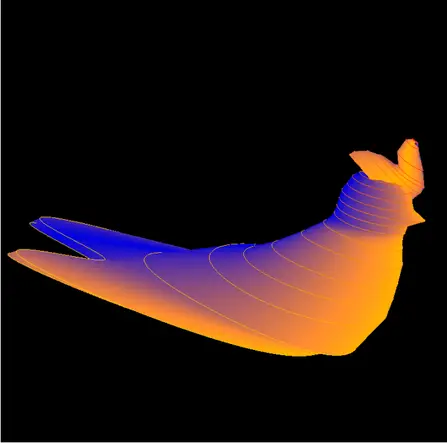
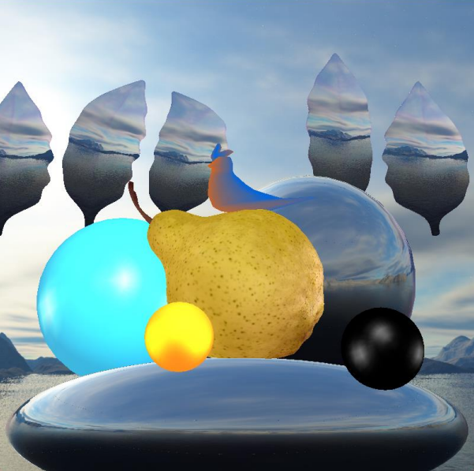
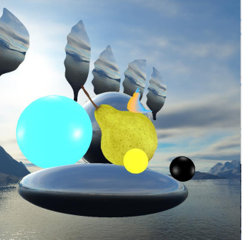
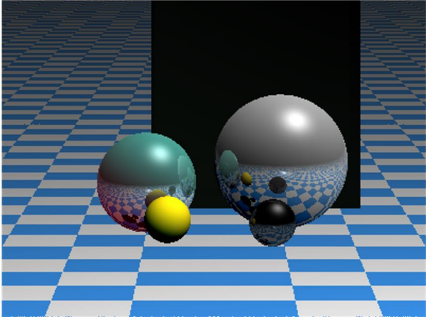

# Graphics_OpenGL

OpenGL computer graphic project in 2020

## Spline Visualization of Bird Model

This project parses the data file to utilize the coordinates of control points to implement B-Spline and Catmull-Rom spline.

You can draw splines using the `draw_splines`, `splines`, `b_spline`, and `catmull_rom` functions in `main.py`.

Running `bird_model/main_with_cps.py` will visualize the control points and the lines connecting them.

You can execute `draw_surface` function to visualize the swept surface as a polygonal mesh.

###### Operation of the Visualization Window:

- Change the viewpoint direction by clicking and dragging.
- Translate the viewpoint left with the 'a' key, right with the 'd' key.
- Translate the viewpoint up with the 'q' key, down with the 'e' key.
- Translate the viewpoint forward with the 'w' key, backward with the 's' key (dolly in / out).
- Perform zoom in / out with the shift+w and shift+s keys.
- Press the 'esc' key to exit the program.

# Scene Rendering with Implicit Surfaces and Polygonal Objects

The scene is comprised of implicit surfaces (spheres) and polygonal objects (bird, pear, and leafs).

Each object in the scene has specific material properties as listed below:

| Material      | Description            |
| ------------- | ---------------------- |
| Yellow rubber | Small sphere           |
| Emerald       | Sphere                 |
| Black plastic | Sphere                 |
| Pearl         | Bottom flat sphere     |
| Ruby          | Used for pear and bird |
| Silver        | Right mirroring sphere |
| Jade          | Background leafs       |

###### Light Sources Positions

- **LIGHT0**: x: 0, y: 90, z: -90
- **LIGHT1**: x: -10, y: 0, z: 0
- **LIGHT2**: x: 10, y: 0, z: 0
- **LIGHT3**: x: 0, y: 0, z: -60

###### Operation of the Visualization Window:

- To execute the visualization window, run `python bird_scene/main.py` in the terminal.
- You can change the viewpoint direction by clicking and dragging.
- Use the 'a' key to translate the viewpoint to the left, and the 'd' key to the right.
- Press 'q' to translate the viewpoint upwards, and 'e' to translate it downwards.
- Use the 'w' key to move the viewpoint forward, and 's' key to move it backward (dolly in / out).
- Zoom in or out by pressing 'shift + w' or 'shift + s'.
- Press 'esc' to exit the program.

## Ray Tracing

- Implemented ray tracing for the spheres, following the composition of previous materials:
  - Yellow rubber (yellow small sphere)
  - Emerald (cyan sphere)
  - Black plastic (black sphere)
  - Silver (large sphere)

Ray Tracing Polygons:

- Represented polygons in the form of cuboids and applied ray tracing.
- Utilized leather-like material composition.

Recursive Reflection:

- Applied reflection to all objects, recursively reflecting each other's light.

Texture Mapped Spheres and Polygons:

- Displayed a grid pattern on the ground plane.

Phong Illumination:

- Applied Phong illumination to all objects, incorporating three light characteristics.

    The properties of the applied materials are as follows:

| Material      | Ambient1 | Ambient2 | Ambient3 | Diffuse1 | Diffuse2 | Diffuse3 | Specular1 | Specular2 | Specular3 | Shininess |
| ------------- | -------- | -------- | -------- | -------- | -------- | -------- | --------- | --------- | --------- | --------- |
| Emerald       | 0.0215   | 0.1745   | 0.0215   | 0.0756   | 0.6142   | 0.0756   | 0.633     | 0.72781   | 0.633     | 0.6       |
| Jade          | 0.135    | 0.2225   | 0.1575   | 0.54     | 0.89     | 0.63     | 0.31622   | 0.31622   | 0.31622   | 0.1       |
| Pearl         | 0.25     | 0.2072   | 0.2072   | 0.2072   | 0.829    | 0.829    | 0.29664   | 0.29664   | 0.29664   | 0.088     |
| Ruby          | 0.1745   | 0.0117   | 0.0117   | 0.6142   | 0.0413   | 0.0413   | 0.72781   | 0.62695   | 0.62695   | 0.6       |
| Silver        | 0.1922   | 0.1922   | 0.1922   | 0.5075   | 0.5075   | 0.5075   | 0.50827   | 0.50827   | 0.50827   | 0.4       |
| Yellow Rubber | 0.05     | 0.05     | 0.0      | 0.5      | 0.5      | 0.4      | 0.7       | 0.7       | 0.04      | 0.078125  |

###### Representative pictures:

